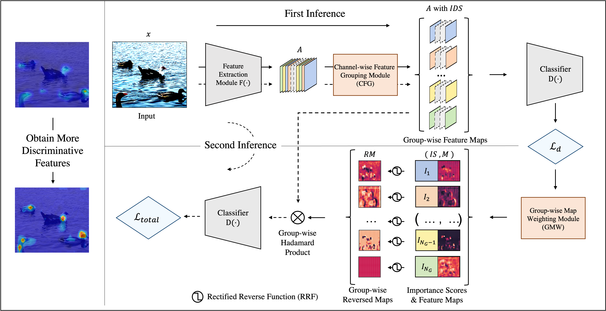
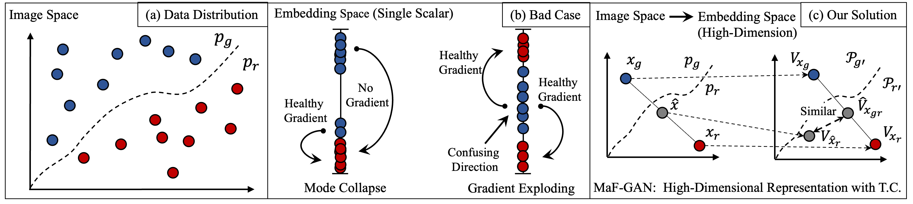
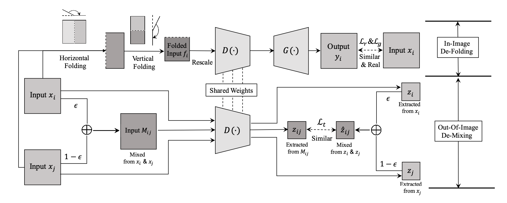
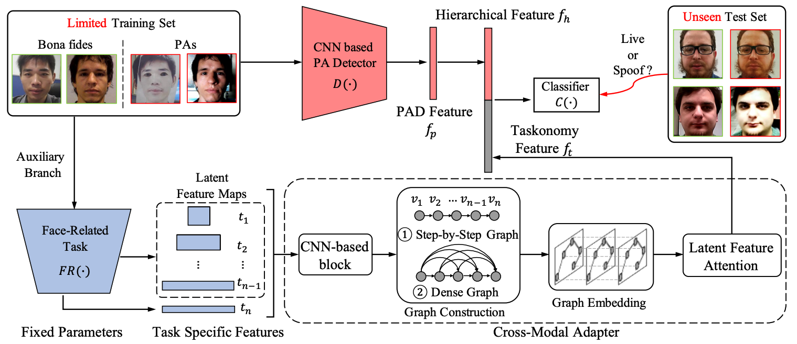
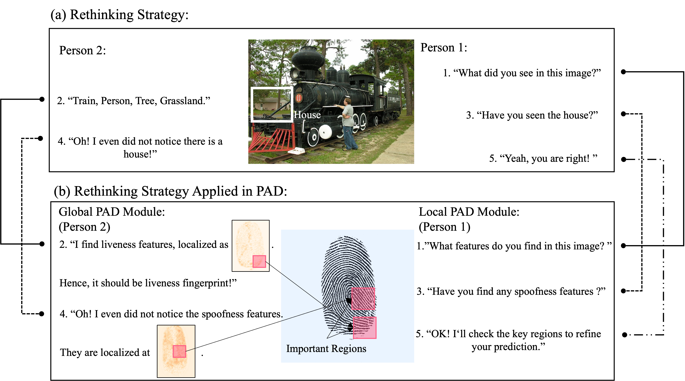
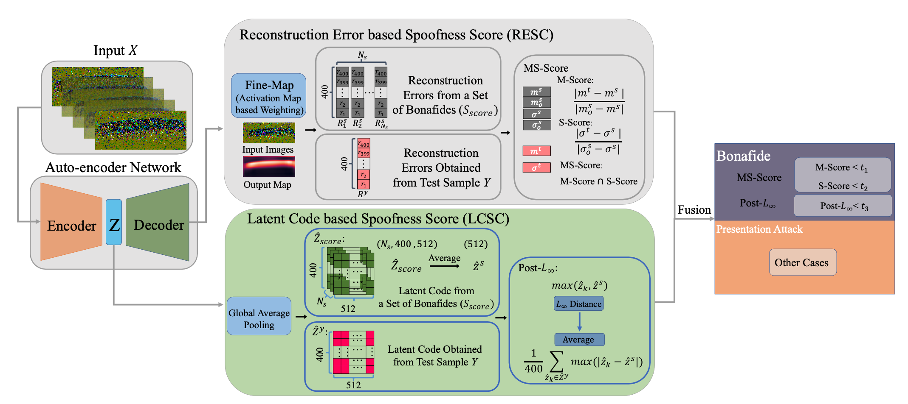
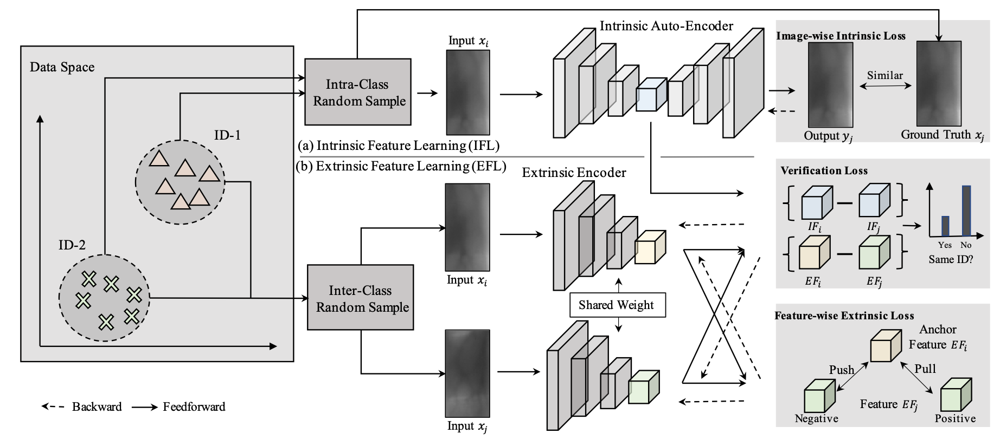

## Haozhe Liu

Haozhe Liu is working towards the MS degree in Computer Vision Institute, Shenzhen University (CS Rank 68 in USNews2020). He had published several papers on top-tier journals/conferences, including ICCV, IEEE trans on Image Processing, IEEE trans on Cybernetics, etc.. Haozhe Liu won First-Class Excellent Academic Scholarship in 2020 and China National Scholarship (**Rate<0.02%, Rank 1** in College of Computer Science and Software Engineering, SZU) in 2021. Currently, he is a member (internship) of [Jarvis Lab](https://jarvislab.tencent.com/), Tencent and a visiting student at AI Initiative, KAUST (supervised by Prof.[Juergen Schmidhuber](https://scholar.google.com/citations?user=gLnCTgIAAAAJ&hl=en)). He serves as a reviewer of the top-tier conferences, e.g. CVPR'2022, ICML'2022 and MICCAI'2022. His research interests include regularization, self-supervised learning, adversarial learning and reinforcement learning. 

Email: liuhaozhe2019@email.szu.edu.cn   |  [Google Scholar Link](https://scholar.google.com/citations?user=QX51P54AAAAJ&hl=zh-CN) | [CV](./haozheliu.pdf) | [GitHub Page](https://github.com/HaozheLiu-ST)

### Selected Publications

**Liu, H.**, Wu, H., Xie, W., Liu, F., & Shen, L. (2021). Group-wise Inhibition based Feature Regularization for Robust Classification. _International Conference on Computer Vision (ICCV)_ 

**Liu, H.**, Liang, H., Hou, X., Wu, H., Liu, F., Shen, L. (2021) Manifold-preserved GANs. _arXiv preprint arXiv:2109.08955_. 

**Liu, H.**, Kong, Z., Ramachandra, R., Liu, F., Shen, L., & Busch, C. (2021). Taming Self-Supervised Learning for Presentation Attack Detection: In-Image De-Folding and Out-of-Image De-Mixing. _arXiv preprint arXiv:2109.04100_.

**Liu, H.**, Zhang, W., Liu, F., Wu, H.,& Shen, L. (2021). Fingerprint Presentation Attack Detector Using Global-Local Model. _IEEE Transactions on Cybernetics_.

Liu, F., **Liu, H**., Zhang, W., Liu, G., & Shen, L. (2021). One-Class Fingerprint Presentation Attack Detection Using Auto-Encoder Network. _IEEE Transactions on Image Processing, 30, 2394-2407_.

Zhang, W.\*, **Liu, H.**\*, Ramachandra, R.\*, Liu, F., Shen, L., & Busch, C. (2021). Face Presentation Attack Detection using Taskonomy Feature. _arXiv preprint arXiv:2111.11046_.(* Equal Contribution)

Liu, F., Shen, C., **Liu, H.**, Liu, G., Liu, Y., Guo, Z., & Wang, L. (2020). A flexible touch-based fingerprint acquisition device and a benchmark database using optical coherence tomography. _IEEE Transactions on Instrumentation and Measurement_, 69(9), 6518-6529.

Liu, F., Kong Z., **Liu, H.**, Zhang W. & Shen L. (2021). Fingerprint Presentation Attack Detection by Channel-wise Feature Denoising. _arXiv preprint arXiv:2111.07620._

Lin, L.\*, **Liu, H.** \*, Zhang, W., Liu, F., & Lai, Z. (2021, August). Finger Vein Verification using Intrinsic and Extrinsic Features. In 2021 _IEEE International Joint Conference on Biometrics (IJCB) (pp. 1-7)_. (* Equal Contribution)

Zhang, W., **Liu, H.**, & Liu, F. (2021, July). Fingerprint Presentation Attack Detection by Learning in Frequency Domain. In 2021 IEEE 2nd International Conference on Pattern Recognition and Machine Learning (PRML) (pp. 183-189). IEEE. (Best Oral Presentation)

Liu, F., **Liu, H.**, Zhang, W., Chen, J., Shen, L. & Wang, L. . A robust roi extraction method for biometrics using adversarial structure. _Acta Automatica Sinica_, 2020, 46(x): 1−14 doi: 10.16383/j.aas.c200156 (In Chinese)

### Research Samples

#### Group-wise Inhibition based Feature Regularization for Robust Classification 

The convolutional neural network (CNN) is vulnerable to degraded images with even very small variations (e.g. corrupted and adversarial samples). One of the possible reasons is that CNN pays more attention to the most discriminative regions, but ignores the auxiliary features when learning, leading to the lack of feature diversity for final judgment. In our method, we propose to dynamically suppress significant activation values of CNN by group-wise inhibition, but not fixedly or randomly handle them when training. The feature maps with different activation distribution are then processed separately to take the feature independence into account. CNN is finally guided to learn richer discriminative features hierarchically for robust classification according to the proposed regularization. Our method is comprehensively evaluated under multiple settings, including classification against corruptions, adversarial attacks and low data regime. Extensive experimental results show that the proposed method can achieve signifi- cant improvements in terms of both robustness and generalization performances, when compared with the state-of-the-art methods. 

Accepted by _ICCV-2021_

[Code](https://github.com/LinusWu/TENET_Training) 

[Arxiv](https://arxiv.org/abs/2103.02152) 

[ICCV-Link](https://openaccess.thecvf.com/content/ICCV2021/html/Liu_Group-Wise_Inhibition_Based_Feature_Regularization_for_Robust_Classification_ICCV_2021_paper.html)

---

#### Manifold-preserved GANs 

Generative Adversarial Networks (GANs) have been widely adopted in various fields. However, existing GANs generally are not able to preserve the manifold of data space, mainly due to the simple representation of discriminator for the real/generated data. To address such open challenges, this paper proposes Manifold-preserved GANs (MaF-GANs), which generalize Wasserstein GANs into high-dimensional form. Specifically, to improve the representation of data, the discriminator in MaF-GANs is designed to map data into a high-dimensional manifold. Furthermore, to stabilize the training of MaF-GANs, an operation with precise and universal solution for any K-Lipschitz continuity, called Topological Consistency is proposed. The effectiveness of the proposed method is justified by both theoretical analysis and empirical results. When adopting DCGAN as the backbone on CelebA (256×256), the proposed method achieved 12.43 FID, which outperforms the state-of-the-art model like Realness GAN (23.51 FID) by a large margin. 

_Code will be made publicly available_. 

[Arxiv](https://arxiv.org/abs/2109.08955)

---

#### Taming Self-Supervised Learning for Presentation Attack Detection: In-Image De-Folding and Out-of-Image De-Mixing

Biometric systems are vulnerable to the Presentation Attacks (PA) performed using various Presentation Attack Instruments (PAIs). Even though there are numerous Presentation Attack Detection (PAD) techniques based on both deep learning and hand-crafted features, the generalization of PAD for unknown PAI is still a challenging problem. The common problem with existing deep learning-based PAD techniques is that they may struggle with local optima, resulting in weak generalization against different PAs. In this work, we propose to use self-supervised learning to find a reasonable initialization against local trap, so as to improve the generalization ability in detecting PAs on the biometric system. The proposed method, denoted as IF-OM, is based on a global-local view coupled with De-Folding and De-Mixing to derive the task-specific representation for PAD.During De-Folding, the proposed technique will learn region-specific features to represent samples in a local pattern by explicitly maximizing cycle consistency. While, De-Mixing drives detectors to obtain the instance-specific features with global information for more comprehensive representation by maximizing topo- logical consistency. Extensive experimental results show that the proposed method can achieve significant improvements in terms of both face and fingerprint PAD in more complicated and hybrid datasets, when compared with the state-of- the-art methods. Specifically, when training in CASIA-FASD and Idiap Replay-Attack, the proposed method can achieve 18.60% Equal Error Rate (EER) in OULU-NPU and MSU-MFSD, exceeding baseline performance by 9.54%. 

_Code will be made publicly available_. 

[Arxiv](https://arxiv.org/abs/2109.04100) 

---

#### Face Presentation Attack Detection using Taskonomy Feature

The robustness and generalization ability of Presentation Attack Detection (PAD) methods is critical to ensure the security of Face Recognition Systems (FRSs). However, in the real scenario, Presentation Attacks (PAs) are various and hard to be collected. Existing PAD methods are highly dependent on the limited training set and cannot generalize well to unknown PAs. Unlike PAD task, other face-related tasks trained by huge amount of real faces (e.g. face recognition and attribute editing) can be effectively adopted into different application scenarios. Inspired by this, we propose to apply taskonomy (task taxonomy) from other face-related tasks to solve face PAD, so as to improve the generalization ability in detecting PAs. The proposed method, first introduces task specific features from other face-related tasks, then, we design a Cross-Modal Adapter using a Graph Attention Network (GAT) to re-map such features to adapt to PAD task. Finally, face PAD is achieved by using the hierarchical features from a CNN-based PA detector and the re-mapped features. The experimental results show that the proposed method can achieve significant improvements in the complicated and hybrid datasets, when compared with the state-of-the-art methods. In particular, when trained using OULU-NPU, CASIA-FASD, and Idiap Replay-Attack, we obtain HTER (Half Total Error Rate) of 5.48% in MSU-MFSD, outperforming the baseline by 7.39%. 

_Code will be made publicly available_. 

[Arxiv](https://arxiv.org/abs/2111.11046) 

---

#### Fingerprint Presentation Attack Detector using Global-Local Model

The vulnerability of automated fingerprint recognition systems (AFRSs) to presentation attacks (PAs) promotes the vigorous development of presentation attack detection (PAD) technology. However, PAD methods have been limited by information loss and poor generalization ability resulting in new PA materials and fingerprint sensors. This paper thus proposes a global-local model based PAD (RTK-PAD) method to overcome those limitations to some extent. The proposed method consists of three modules, named as global module, local module and rethinking module. By adopting Cut-out based global module, a global spoofness score predicted from non-local features of the whole fingerprint images can be achieved. While by using texture in-painting based local module, a local spoofness score predicted from fingerprint patches is obtained. The two modules are not independent, but connected through our proposed rethinking module by localizing two discriminative patches for local module based on the global spoofness score. Finally, the fusion spoofness score by averaging the global and local spoofness scores is used for PAD. Our experimental results evaluated on LivDet 2017 show that the proposed RTK-PAD can achieve an Average Classification Error (ACE) of 2.28% and a True Detection Rate (TDR) of 91.19% when the False Detection Rate (FDR) equals to 1.0%, which significantly outperformed the state-of-the-art methods by ∼10% in terms of TDR (91.19% vs. 80.74%). 

Accepted by _IEEE Trans on Cybernetics_

[Code](https://github.com/HaozheLiu-ST/RTK-PAD)

[IEEE Link](https://ieeexplore.ieee.org/abstract/document/9457215)

---

#### One-Class Fingerprint Presentation Attack Detection Using Auto-Encoder Network

Automated Fingerprint Recognition Systems (AFRSs) have been threatened by Presentation Attack (PA) since its existence. It is thus desirable to develop effective presentation attack detection (PAD) methods. However, the unpredictable PAs make PAD be a challenging problem. This paper proposes a novel One-Class PAD (OCPAD) method for Optical Coherence Technology (OCT) images based fingerprint PA detection. The proposed OCPAD model is learned from a training set only consists of Bonafides (i.e. real fingerprints). The reconstruction error and latent code obtained from the trained auto-encoder network in the proposed model is taken as the basis for the following spoofness score calculation. To get more accurate reconstruction error, we propose an activation map based weighting model to further refine the accuracy of reconstruction error. We test different statistics and distance measures and finally use a decision level fusion to make the final prediction. Our experiments are performed using a dataset with 93200 bonafide scans and 48400 PA scans. The results show that the proposed OCPAD can achieve a True Positive Rate (TPR) of 99.43% when the False Positive Rate (FPR) equals to 10% and a TPR of 96.59% when FPR=5%, which significantly outperformed a feature based approach and a supervised learning based model requiring PAs for training.

Accepted by _IEEE Trans on Image Processing_ 

[IEEE Link](https://ieeexplore.ieee.org/abstract/document/9335499)

---

#### Finger Vein Verification using Intrinsic and Extrinsic Features

Finger vein has attracted substantial attention due to its good security. However, the variability of the finger vein data will be caused by the illumination, environment temperature, acquisition equipment, and so on, which is a great challenge for finger vein recognition. To address this problem, we propose a novel method to design an end- to-end deep Convolutional Neural Network (CNN) for robust finger vein recognition. The approach mainly includes an Intrinsic Feature Learning (IFL) module using an auto-encoder network and an Extrinsic Feature Learning (EFL) module based on a Siamese network. The IFL module is designed to estimate the expectation of intra-class finger vein images with various offsets and rotation, while the EFL module is constructed to learn the inter-class feature representation. Then, robust verification is finally achieved by considering the distances of both intrinsic and extrinsic features. We conduct experiments on two public datasets (i.e. SDUMLA-HMT and MMCBNU 6000) and an in-house dataset (MultiView-FV) with more deformation finger vein images, and the equal error rate (EER) is 0.47%, 0.1%, and 1.69% respectively. The comparison against baseline and existing algorithms shows the effectiveness of our proposed method.

Accepted by _IJCB-2021_ 

[Dataset Page](https://github.com/FengLiu-0013/A-challenging-benchmark-dataset-with-multiview-finger-vein-images)

[IEEE Link](https://ieeexplore.ieee.org/abstract/document/9484401)

### Research Experience

#### Jarvis Lab (Tencent) 
Internship supervised by Mentor: [Dr. Nanjun He](https://scholar.google.ch/citations?user=w3iS1G0AAAAJ&hl=en) & [Dr. Yuexiang Li](https://scholar.google.com/citations?user=WsKu4EMAAAAJ&hl=en), Leader: [Dr. Kai Ma](https://scholar.google.ch/citations?user=FSSXeyAAAAAJ&hl=en) and Director: [Dr. Yefeng Zheng](https://scholar.google.ch/citations?user=vAIECxgAAAAJ&hl=en) 
  
- Proposed Dynamic Feature Aggregation to improve the robustness against adversarial attacks, which is submitted to **CVPR2022**
  
---

#### Norwegian Biometrics Laboratory (NTNU)
Visiting student supervised by  [Prof. Raghavendra Ramachandra](https://scholar.google.com/citations?user=OIYIrmIAAAAJ&hl=en) and [Prof. Christoph Busch](https://scholar.google.com/citations?user=qsopcXIAAAAJ&hl=en)

- Proposed a self-supervised learning based method for face and fingerprint presentation attack detection, which is submitted to **CVPR 2022**.
- Proposed a face presentation attack detector based on the taskonomy features, which is prepared to submit to **CVPR 2022**.

---

#### Computer Vision Insitute (SZU)
M.S. supervised by [Prof. Feng Liu](https://scholar.google.com/citations?hl=zh-CN&user=45uLWocAAAAJ) and [Prof. Linlin Shen](https://scholar.google.com/citations?hl=zh-CN&user=AZ_y9HgAAAAJ)
- Proposed a regularization method to imporve the robustness of CNN based models, which is accepted by **ICCV 2021** and open source.
- Proposed a Manifold-preserved GANs to mitigate the mode collapse and gradient exploding, which is prepared to submit to **CVPR 2022**.
- Collected a famous presentation attack dataset based on OCT and **for the first time** established a one-class framework for OCT based PAD. This work is accepted by **IEEE TIP**
- Proposed a presentation attack detector using Global-Local model, which reaches over 90% in terms of TDR@FDR=1% on LivDet2017 **for the first time**. (Accepted by **IEEE TCYB**)

### Education

M.S. in Computer Vision Institute (CVI), Shenzhen University (SZU) under the supervision of [Prof. Feng Liu](https://scholar.google.com/citations?hl=zh-CN&user=45uLWocAAAAJ) and [Prof. Linlin Shen](https://scholar.google.com/citations?hl=zh-CN&user=AZ_y9HgAAAAJ)

- China National Scholarship (Rate<0.02%, Rank 1 in SZU) in 2021 
- Excellent Academic Scholarship, First Class in 2020
- Excellent Academic Scholarship, Second Class in 2020
