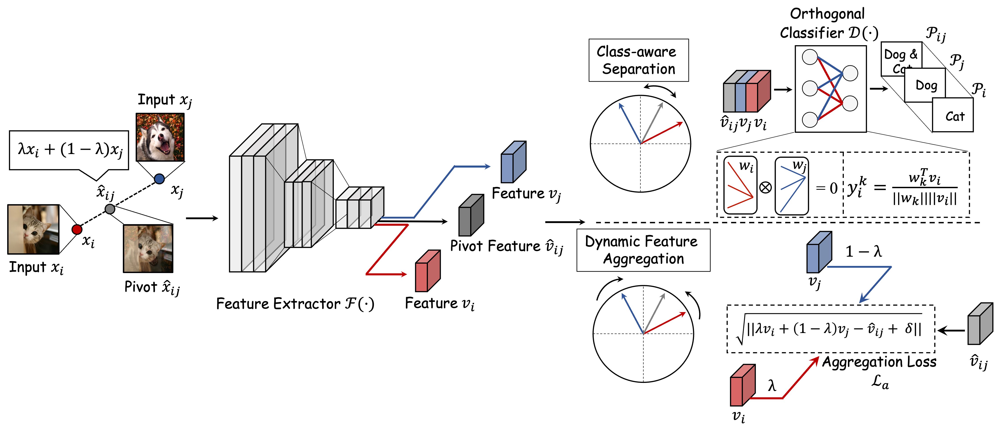

## Haozhe Liu

Haozhe Liu is working towards the MS degree in Computer Vision Institute, Shenzhen University (CS Rank 68 in USNews2020). He had published several papers on top-tier journals/conferences, including CVPR, ICCV, IEEE trans on Image Processing, etc.. Haozhe Liu won First-Class Excellent Academic Scholarship in 2020 and China National Scholarship (**Rate<0.02%, Rank 1** in College of Computer Science and Software Engineering, SZU) in 2021. Currently, he is a member (internship) of [Jarvis Lab](https://jarvislab.tencent.com/), Tencent and a visiting student at AI Initiative, KAUST (supervised by Prof.[Juergen Schmidhuber](https://scholar.google.com/citations?user=gLnCTgIAAAAJ&hl=en)). He serves as a reviewer of the top-tier conferences, e.g. CVPR'2022, ICML'2022, ECCV'2022 and MICCAI'2022. His research interests include regularization, self-supervised learning, adversarial learning and reinforcement learning. 

\[Email\]:  haozhe.liu@kaust.edu.sa; liuhaozhe2019@email.szu.edu.cn

### News

\[2022-9\] **He will join AI Initiative, KAUST to pursue the PhD degree under the supervision of Juergen Schmidhuber!**

\[2022-5\] [Our method (Group-wise Inhibition)](https://github.com/LinusWu/TENET_Training) is merged into the official benchmark of [ImageNet-C](https://github.com/hendrycks/robustness)! 

\[2022-5\] 2 papers are submitted to MICCAI'2022 and 3 papers are submitted to ECCV'2022. Best wishes for them!  

\[2022-4\] He is invited as a reviewer for ICML'2022, ECCV'2022 and MICCAI'2022.  

\[2022-3\] Our paper (Scene Consistency Representation Learning for Video Scene Sgementation) is accepted by CVPR'2022!

\[2021-10\] He is invited as a reviewer for CVPR'2022.

\[2021-7\] Our paper (Group-wise Inhibition based Feature Regularization for Robust Classification) is accepted by ICCV'2021!

### Selected Publications

**Liu, H.**, Wu, H., Xie, W., Liu, F., & Shen, L. (2021). Group-wise Inhibition based Feature Regularization for Robust Classification. _International Conference on Computer Vision (ICCV)_ 

**Liu, H.**, Ji, H., Li, Y., He, N., Wu, H., Liu, F., Shen, L. & Zheng, Y. (2022). Robust Representation via Dynamic Feature Aggregation. arXiv preprint arXiv:2205.07466.

**Liu, H.**, Liang, H., Hou, X., Wu, H., Liu, F., Shen, L. (2021) Manifold-preserved GANs. _arXiv preprint arXiv:2109.08955_. 

**Liu, H.**, Kong, Z., Ramachandra, R., Liu, F., Shen, L., & Busch, C. (2021). Taming Self-Supervised Learning for Presentation Attack Detection: In-Image De-Folding and Out-of-Image De-Mixing. _arXiv preprint arXiv:2109.04100_.

**Liu, H.**, Zhang, W., Liu, F., Wu, H.,& Shen, L. (2021). Fingerprint Presentation Attack Detector Using Global-Local Model. _IEEE Transactions on Cybernetics_.

Liu, F., **Liu, H**., Zhang, W., Liu, G., & Shen, L. (2021). One-Class Fingerprint Presentation Attack Detection Using Auto-Encoder Network. _IEEE Transactions on Image Processing, 30, 2394-2407_.

Zhang, W.\*, **Liu, H.**\*, Ramachandra, R.\*, Liu, F., Shen, L., & Busch, C. (2021). Face Presentation Attack Detection using Taskonomy Feature. _arXiv preprint arXiv:2111.11046_.(**\* Equal Contribution**)

### Research Samples

#### Group-wise Inhibition based Feature Regularization for Robust Classification 

The convolutional neural network (CNN) is vulnerable to degraded images with even very small variations (e.g. corrupted and adversarial samples). One of the possible reasons is that CNN pays more attention to the most discriminative regions, but ignores the auxiliary features when learning, leading to the lack of feature diversity for final judgment. In our method, we propose to dynamically suppress significant activation values of CNN by group-wise inhibition, but not fixedly or randomly handle them when training. The feature maps with different activation distribution are then processed separately to take the feature independence into account. CNN is finally guided to learn richer discriminative features hierarchically for robust classification according to the proposed regularization. Our method is comprehensively evaluated under multiple settings, including classification against corruptions, adversarial attacks and low data regime. Extensive experimental results show that the proposed method can achieve signifi- cant improvements in terms of both robustness and generalization performances, when compared with the state-of-the-art methods. 

Accepted by _ICCV-2021_ [Code](https://github.com/LinusWu/TENET_Training) [Arxiv](https://arxiv.org/abs/2103.02152) [ICCV-Link](https://openaccess.thecvf.com/content/ICCV2021/html/Liu_Group-Wise_Inhibition_Based_Feature_Regularization_for_Robust_Classification_ICCV_2021_paper.html)

---

#### Manifold-preserved GANs 

Generative Adversarial Networks (GANs) have been widely adopted in various fields. However, existing GANs generally are not able to preserve the manifold of data space, mainly due to the simple representation of discriminator for the real/generated data. To address such open challenges, this paper proposes Manifold-preserved GANs (MaF-GANs), which generalize Wasserstein GANs into high-dimensional form. Specifically, to improve the representation of data, the discriminator in MaF-GANs is designed to map data into a high-dimensional manifold. Furthermore, to stabilize the training of MaF-GANs, an operation with precise and universal solution for any K-Lipschitz continuity, called Topological Consistency is proposed. The effectiveness of the proposed method is justified by both theoretical analysis and empirical results. When adopting DCGAN as the backbone on CelebA (256×256), the proposed method achieved 12.43 FID, which outperforms the state-of-the-art model like Realness GAN (23.51 FID) by a large margin. 

_Code will be made publicly available_.  [Arxiv](https://arxiv.org/abs/2109.08955)

---

#### Dynamic Feature Aggregation 

Deep convolutional neural network (CNN) based mod- els are vulnerable to the adversarial attacks. One of the possible reasons is that the embedding space of CNN based model is sparse, resulting in a large space for the generation of adversarial samples. In this study, we propose a method, denoted as Dynamic Feature Aggregation, to compress the embedding space with a novel regularization. Particularly, the convex combination between two samples are regarded as the pivot for aggregation. In the embedding space, the selected samples are guided to be similar to the representation of the pivot. On the other side, to mitigate the trivial solution of such regularization, the last fully-connected layer of the model is replaced by an orthogonal classifier, in which the embedding codes for different classes are processed or- thogonally and separately. With the regularization and orthogonal classifier, a more compact embedding space can be obtained, which accordingly improves the model robust- ness against adversarial attacks. An averaging accuracy of 56.91% is achieved by our method on CIFAR-10 against various attack methods, which significantly surpasses a solid baseline (Mixup) by a margin of 37.31%. More surprisingly, empirical results show that, the proposed method can also achieve the state-of-the-art performance for out-of-distribution (OOD) detection, due to the learned com- pact feature space. An F1 score of 0.937 is achieved by the proposed method, when adopting CIFAR-10 as in-distribution (ID) dataset and LSUN as OOD dataset. 

[Code](https://github.com/HaozheLiu-ST/DynamicFeatureAggregation) [Arxiv](https://arxiv.org/abs/2205.07466)

### Research Experience

#### AI Initiative (KAUST) 
Visiting Student / Prospective PhD Student supervised by Prof. [Juergen Schmidhuber](https://scholar.google.com/citations?user=gLnCTgIAAAAJ&hl=en).

- Research Field:Reinforcement Learning; Upside-Down Reinforcement Learning; Generative Adversarial Task; Self-supervised Learning; Regularization

---

#### Jarvis Lab (Tencent) 
Internship supervised by Mentor: [Dr. Nanjun He](https://scholar.google.ch/citations?user=w3iS1G0AAAAJ&hl=en) & [Dr. Yuexiang Li](https://scholar.google.com/citations?user=WsKu4EMAAAAJ&hl=en), Leader: [Dr. Kai Ma](https://scholar.google.ch/citations?user=FSSXeyAAAAAJ&hl=en) and Director: [Dr. Yefeng Zheng](https://scholar.google.ch/citations?user=vAIECxgAAAAJ&hl=en) 
  
- Proposed Dynamic Feature Aggregation to improve the robustness against adversarial attacks.

- Proposed offline entropy estimation to combat mode collapse, which is submitted to **ECCV'2022**. (This project is cooperated with AI Initiative, KAUST.)  

---

#### Norwegian Biometrics Laboratory (NTNU)
Visiting student supervised by  [Prof. Raghavendra Ramachandra](https://scholar.google.com/citations?user=OIYIrmIAAAAJ&hl=en) and [Prof. Christoph Busch](https://scholar.google.com/citations?user=qsopcXIAAAAJ&hl=en)

- Proposed a self-supervised learning based method for face and fingerprint presentation attack detection, which is submitted to **TIFS**.
- Proposed a face presentation attack detector based on the taskonomy features, which is submitted to **ECCV'2022**.

---

#### Computer Vision Insitute (SZU)
M.S. supervised by [Prof. Feng Liu](https://scholar.google.com/citations?hl=zh-CN&user=45uLWocAAAAJ) and [Prof. Linlin Shen](https://scholar.google.com/citations?hl=zh-CN&user=AZ_y9HgAAAAJ)
- Proposed a regularization method to imporve the robustness of CNN based models, which is accepted by **ICCV'2021** and open source.
- Proposed a Manifold-preserved GANs to mitigate the mode collapse and gradient exploding.
- Collected a famous presentation attack dataset based on OCT and **for the first time** established a one-class framework for OCT based PAD. This work is accepted by **IEEE TIP**
- Proposed a presentation attack detector using Global-Local model, which reaches over 90% in terms of TDR@FDR=1% on LivDet2017 **for the first time**. (Accepted by **IEEE TCYB**)
